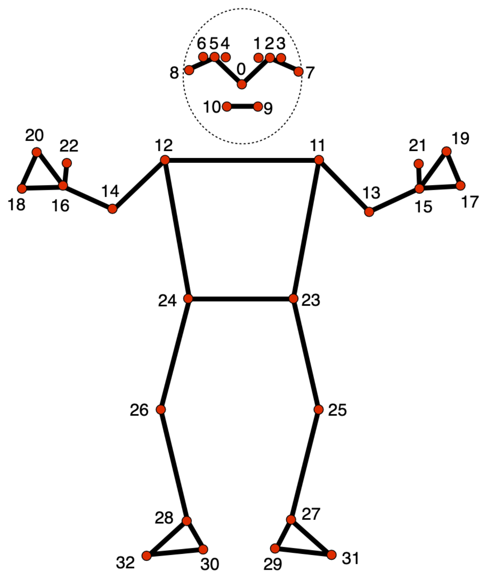
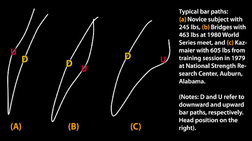

# BenchMetric — Bench Press Analyzer (Streamlit + MediaPipe)

BenchMetric is a small computer-vision app that analyzes bench press technique from an uploaded video. It uses **MediaPipe Pose** for landmark detection and **OpenCV** for frame processing, then produces per-rep metrics and charts in a **Streamlit** UI.




## Features

- Upload `.mp4` bench press videos in the browser (Streamlit)
- Frame-by-frame analysis (OpenCV + MediaPipe)
- Phase detection: `START / ECCENTRIC / BOTTOM / CONCENTRIC`
- Per-rep/per-phase metrics:
  - `Duration_s`, `Velocity_avg`, `Distance_px`
  - `Bottom_pause`, `Asymmetry`
- Visual output:
  - live preview while analyzing
  - metrics table
  - velocity / duration charts
- Saves results to `results.csv`

## Requirements

- Python 3.10+ (Python 3.11 recommended)
- Dependencies from `requirements.txt`

> Note: this repo uses `opencv-python-headless` (great for Docker and servers without a GUI). If you want to run the non-Streamlit mode with `cv2.imshow`, you’ll typically want `opencv-python` instead.

## Quickstart (local)

Install dependencies:

```bash
pip install -r requirements.txt
```

Run the Streamlit app:

```bash
streamlit run app.py
```

Then open `http://localhost:8501`, upload a video, and click **Analyze video**.

## Run with Docker

Build the image:

```bash
docker build --no-cache -t bench-metric .
```

Run the container:

```bash
docker run --rm -p 8501:8501 bench-metric
```

Open `http://localhost:8501`.

## How to use

1. Open the app.
2. Upload an `.mp4` file.
3. Adjust settings:
   - **Delay** — artificial slowdown (useful for watching the analysis).
   - **Right mode** — analyze the right side (default is left).
4. Click **Analyze video**.
5. After it finishes, you’ll see:
   - a DataFrame with metrics
   - charts
   - `results.csv` written in the project directory

## Output (`results.csv`)

The CSV is generated automatically after analysis. Columns include:

- `Repetition` — repetition index
- `Phase` — movement phase
- `Duration_s` — phase duration
- `Velocity_avg` — average velocity in the phase (px/s)
- `Distance_px` — bar path distance in the phase (px)
- `Bottom_pause` — bottom pause detected (0/1)
- `Asymmetry` — wrist asymmetry detected (0/1)

## Project structure

- `app.py` — Streamlit UI (upload, progress, charts)
- `main.py` — video processing loop (OpenCV) + progress reporting
- `pose_module.py` — pose logic, phase detection, metrics, CSV export
- `assets/` — sample images and videos

## Troubleshooting

### Progress bar is stuck / very laggy

- Video analysis is CPU-bound and runs in a tight loop. Updating the progress bar too frequently can slow things down.
- The code updates progress every few frames. You can tweak `progress_every_n_frames` in `main.py`.
- Some video backends report an unknown frame count (`CAP_PROP_FRAME_COUNT` returns 0). In that case the app can only display a status message (no accurate percentage).

### Video won’t load / codec issues

- Ensure the file is a valid `.mp4` (H.264 is usually the safest choice).

### OpenCV window mode (`cv2.imshow`) doesn’t work

- In Streamlit/Docker mode the preview is rendered via `st.image`.
- For desktop window mode, consider switching from `opencv-python-headless` to `opencv-python`.

